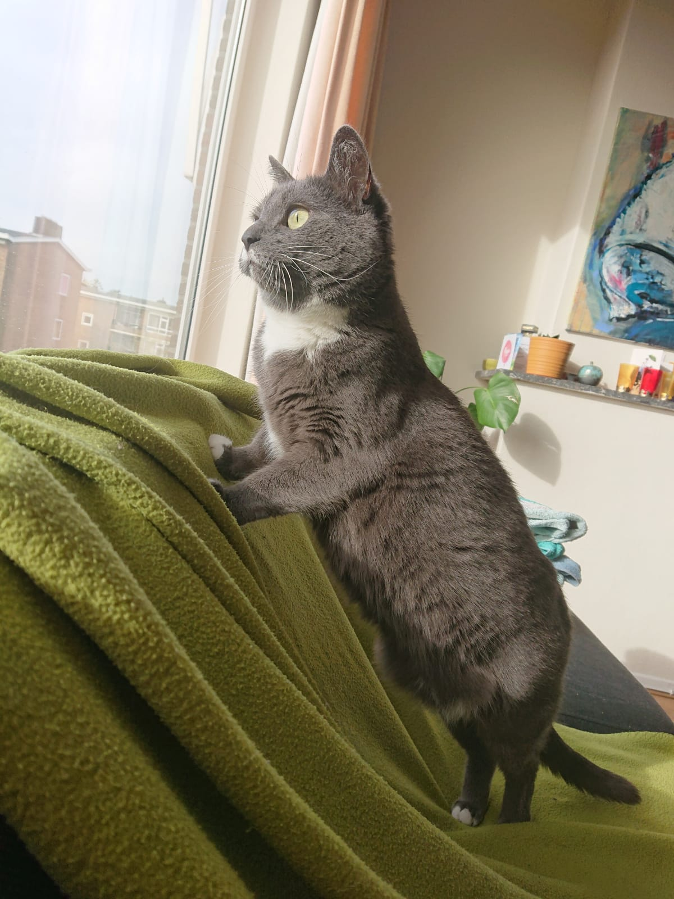

```{r}
# Default knitr options
knitr::opts_chunk$set(echo = FALSE,
                      message = FALSE,
                      dpi = 300,
                      digits = 2,
                      results = 'asis'
                      )

library(tidyverse)

```

# First online meeting

The first meeting in an online format only attracted a few participants. We briefly discussed interactive plots with plotly. Below a copy of the demo found in the package.

```{r}
library(plotly)

# see https://vimeo.com/202647310 

d <- highlight_key(txhousing, ~city, "Select a city")

p <- ggplot(d, aes(date, median, group = city)) + geom_line()

ggplotly(p, tooltip = "city") %>%
   layout(title = "Click on a line to highlight a year") %>%
   highlight(dynamic = TRUE, selectize = TRUE)


# crosstalk keys are automatically added to the group aesthetic...
# if you want to avoid adding the key to group for a layer,
# use the original data
p <- ggplot(d, aes(month, median)) +
   geom_line(aes(group = city)) + 
   geom_smooth(data = txhousing, method = "gam") + 
   facet_wrap(~ year)

ggplotly(p) %>%
   layout(title = "Click on a line to highlight a year")

 # perhaps a more useful example
 sd <- highlight_key(txhousing, ~year)

p <- ggplot(sd, aes(month, median)) +
   geom_line(aes(group = year)) + 
   geom_smooth(data = txhousing, method = "gam") + 
   facet_wrap(~ city)

ggplotly(p, height = 800, width = 1600) %>%
   layout(title = "Click on a line to highlight a year")

```

# Cats spotted during the meeting

```{r}



```

