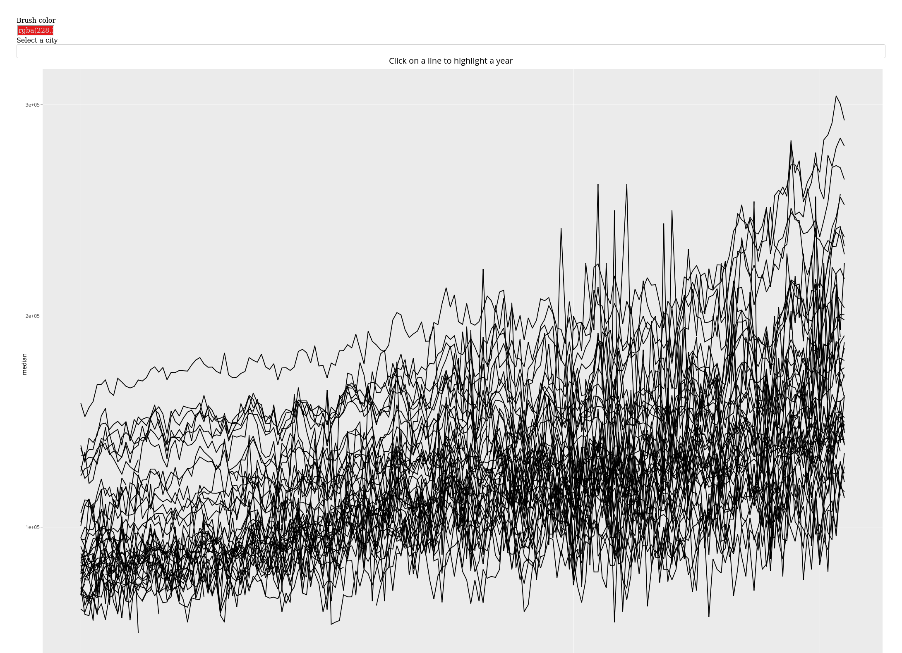
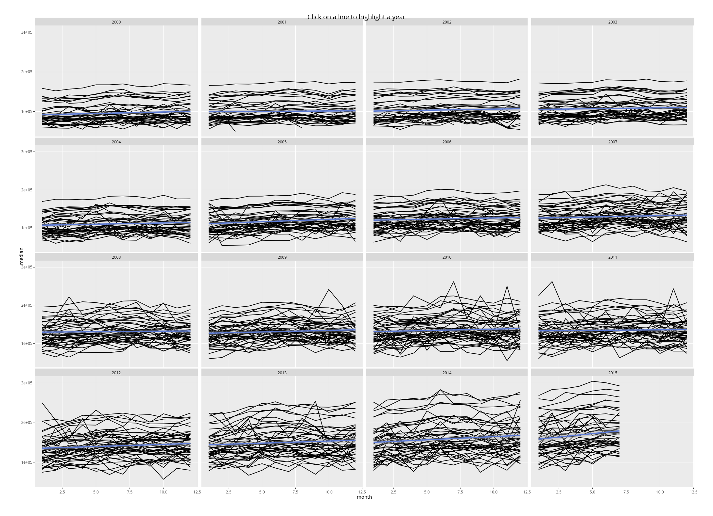
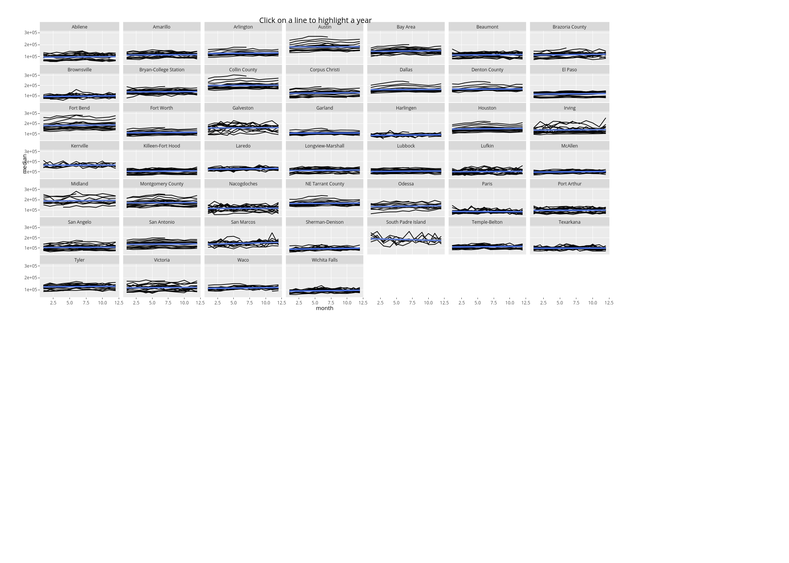

Meeting notes
================
Martin Schobben
17 June, 2020

``` r
# Default knitr options
knitr::opts_chunk$set(echo = FALSE,
                      message = FALSE,
                      dpi = 300,
                      digits = 2,
                      results = 'asis'
                      )

library(tidyverse)
```

    ## ── Attaching packages ──────────────────────────────────────────────────────────────────────────────── tidyverse 1.2.1 ──

    ## ✔ ggplot2 3.2.1     ✔ purrr   0.3.3
    ## ✔ tibble  2.1.3     ✔ dplyr   0.8.3
    ## ✔ tidyr   1.0.0     ✔ stringr 1.4.0
    ## ✔ readr   1.3.1     ✔ forcats 0.4.0

    ## ── Conflicts ─────────────────────────────────────────────────────────────────────────────────── tidyverse_conflicts() ──
    ## ✖ dplyr::filter() masks stats::filter()
    ## ✖ dplyr::lag()    masks stats::lag()

# First online meeting

The first meeting in an online format only attracted a few participants.
We briefly discussed interactive plots with plotly. Below a copy of the
demo found in the
    package.

<!-- -->

    ## Warning: Removed 616 rows containing non-finite values (stat_smooth).

<!-- -->

    ## Warning: Removed 616 rows containing non-finite values (stat_smooth).

<!-- -->
