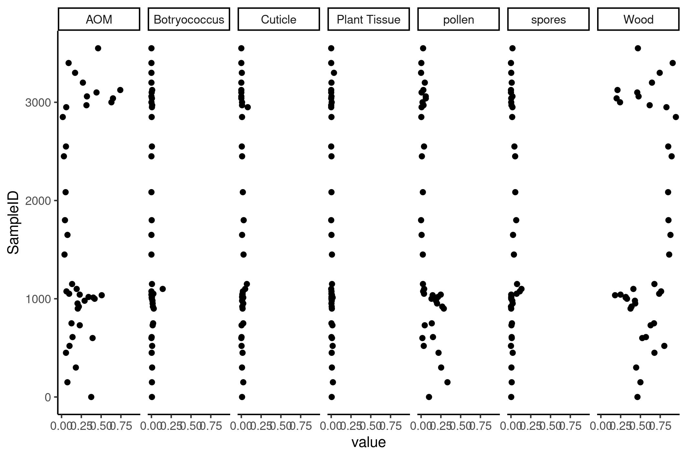

```{r setup, include=FALSE}
# Default knitr options
knitr::opts_chunk$set(
   dpi = 300,
   digits = 2,
   results = 'asis'
   )
```

A minimal example of a workflow for plotting timeseries in geology with `tidyverse`.

Load `tidyverse`, your swiss army knife!

```{r tidy, message=FALSE}

library(tidyverse)

```


# Reading csv files with readr


Here is an example of loading palynofloral dataset that I published some time ago. This is in csv format and can be best loaded with the package `readr` which is part of `tidyverse`. I defined here which columns I want to load; discarding columns with `col_type = "-"`, and assigning classes by `col_type = "d"`. The `"d"` stands for double precision numeric. However, the `readr` package normally assigns classes quite well, without any further help.


```{r readr}

# install.packages("readr")
# library(readr) is already loaded with tidyverse
bonenburg <- read_csv(
   "https://raw.githubusercontent.com/MartinSchobben/bonenburg/master/supplement/data/palynomorphs/Bonenburg_palyno.csv", 
   col_types = "d--ddddddd-"
   )

```


This data is now in a wide format.


```{r wide , echo=FALSE}

head(bonenburg) %>% knitr::kable()

```


# Reading xlsx workbook

You can also just load a xlsx workbook, if that is your preferred way of working with data. For this you can use the package: `readxl`, which is not loaded with the `tidyverse` package.


```{r readxl}

library(readxl) 
tb_xlsx <- read_xlsx(readxl_example("clippy.xlsx"))

```


```{r xlsx, echo=FALSE}

knitr::kable(head(tb_xlsx))

```

# Long format

After loading the data, first adjust your dataframe to a long format, where every observation is just one variable with a label identifying what type of data is associated with it. This can be done with the function `pivot_longer()`.


```{r long}

# long format
long_format <- bonenburg %>% 
   tidyr::pivot_longer(-SampleID)

```


```{r, echo=FALSE}

head(long_format) %>% knitr::kable()

```


# Plotting data for exploration with ggplot2


Finally, we can plot this data with `ggplot2` and display all the variable by making use of `facet_grid()`.

```{r ggplot, warning=FALSE}

ggplot(long_format, aes(y = SampleID , x = value)) +
   geom_point() +
   facet_grid(cols = vars(name)) +
   theme_classic()

```

```{r print, echo = FALSE}

p <- ggplot(long_format, aes(y = SampleID , x = value)) +
   geom_point() +
   facet_grid(cols = vars(name)) +
   theme_classic()

ggsave("bonenburg.jpg", p, width = 18, height = 12, unit = "cm")
```


```{r echo = FALSE}


```

