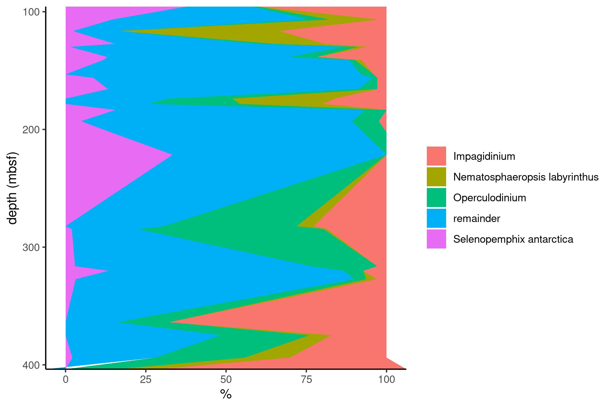

<!-- README.md is generated from README.Rmd. Please edit that file -->

```{r, include=FALSE}
knitr::opts_chunk$set(
  collapse = TRUE,
  comment = "#>"
)
```


```{r root, include=FALSE}
library(here)
here::i_am("README.Rmd")
```


The goal of this meeting is to find optimal solutions to visualise your data. This PPGU workshop is especially addressing the needs for good figures for the up-and-coming NAC meeting.


# Reproducible workflow - part 2

Recreating figure of Sangiorgi et al 2018 in Nature Communications.

<https://doi.org/10.1038/s41467-017-02609-7>

# Load package

```{r pkgs}
library(tidyverse)
```


# Load data

The data is on github and only a call with `read_csv()` is required to load the data.


```{r load}
github_path <- "https://raw.githubusercontent.com/uu-code-club/meetings/master/2021-03-24/Sangiorgi_SupplData4_dinoflagellatecysts.csv"
tb_dino <- read_csv(github_path, col_types = cols(.default = "?"))
```


# Data wrangling

To get the data in the right order for plotting I select the species as well as genera. The genera ar then pooled in the `mutate()` call, thereafter a `pivot_longer()` operation transforms the remaining data in long format for plotting.


```{r wrangling}
dino_species <- c("Selenopemphix antarctica", "Nematosphaeropsis labyrinthus")
dino_genera <- c("Impagidinium", "Operculodinium")
# Selecting
tb_area <- tb_dino %>% 
  select(
    depth = "depth (mbsf)",
    any_of(dino_species), 
    starts_with(dino_genera[1]), 
    starts_with(dino_genera[2])
    ) %>% 
  rowwise() %>% 
  mutate(
    !!dino_genera[1] := sum(c_across(starts_with(dino_genera[1]))),
    !!dino_genera[2] := sum(c_across(starts_with(dino_genera[2]))),
    .keep = "unused"
    ) %>% 
  mutate(remainder = 100 - sum(c_across(-depth))) %>% 
  drop_na() %>% 
  pivot_longer(-depth, names_to = "taxa", values_to = "percent") 

```


# Area plot

The plot call is rather simple, just mind that you specify the orientation.

```{r area}
p <- ggplot(tb_area, aes(x = percent , y = depth, fill = taxa)) +
  geom_area(position = "stack", orientation = "y") +
  scale_y_continuous(expand = c(0,0), trans = "reverse") +
  scale_x_continuous(expand = c(0,0)) +
  labs(
    fill = "",
    y = "depth (mbsf)",
    x = "%"
  ) +
  theme_classic()
```


```{r save, include=FALSE}
ggsave("sangiorgietal2018.jpg", p, width = 18, height = 12, unit = "cm")
```


```{r echo = FALSE}

```
