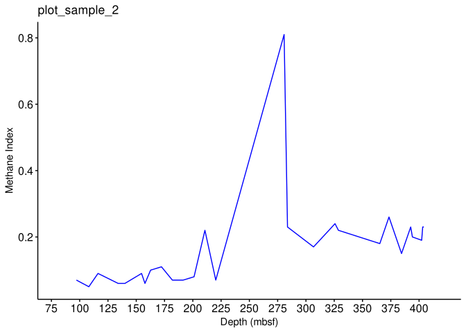
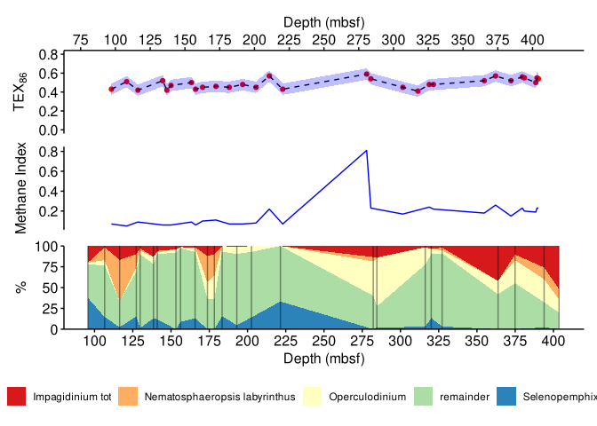
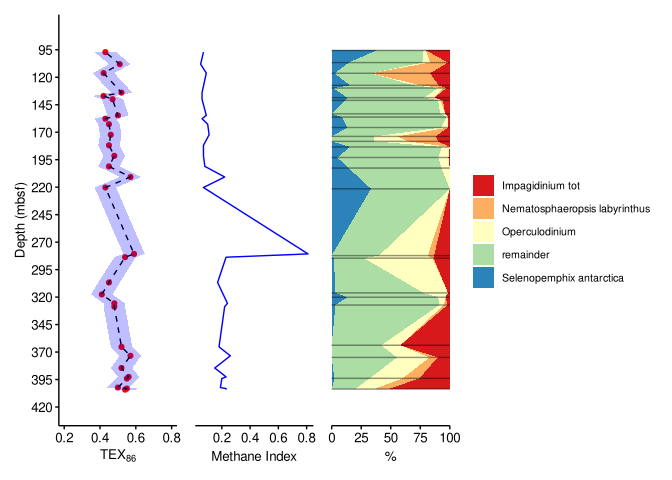

Meeting notes
================
2022-03-04

<!-- README.md is generated from README.Rmd. Please edit that file -->

In this meeting / workshop, we explain how to make a figure of combined
geochemical and dinocyst assemblage data, against depth. The used data
is retrieved from:

Sangiorgi, F., Bijl, P.K., Passchier, S. et al. Southern Ocean warming
and Wilkes Land ice sheet retreat during the mid-Miocene. Nat Commun 9,
317 (2018). <https://doi.org/10.1038/s41467-017-02609-7>

# Load packages

``` r
library(tidyverse)
library(ggplot2)
library(patchwork)
library(readr)
```

# Load datasets

``` r
# read data files
TEX <- read_csv("https://raw.githubusercontent.com/uu-code-club/meetings/master/2022-03-10/figure_making/Sangiorgi_TEX.csv")
Dino <- read_csv("https://raw.githubusercontent.com/uu-code-club/meetings/master/2022-03-10/figure_making/Sangiorgi_dino.csv")
```

# Fig 1 - TEX86 versus depth

``` r
# TEX is loaded as dataset and the depth column is mapped to the x-axis, and TEX to the y-axis
ggplot(data = TEX, mapping = aes(x = `Depth mbsf`, y = `TEX`)) +
  # the first geometry, a simple red point per measurement is added
  geom_point(colour = "red") +
  # in a similar way, we add a line, and specify its width
  geom_line(linetype = 2) +
  # An artifical "error" of 0.06 TEX86 units has been added and plotted using geom_ribbon. We make it transparent by changing the alpha
  geom_ribbon(
    mapping = aes(ymin = (TEX - 0.06), ymax = (TEX + 0.06)),
    alpha = 0.25, fill = "blue"
  ) +
  # we add the title off the plot and of the axis
  labs(title = "plot_sample_1", x = "Depth (mbsf)", y = TEX[86] ~ "(-)") +
  # we can specify the breaks of the x-axis
  scale_x_continuous(breaks = seq(75, 420, 25)) +
  # and also the limits of the x and y axis
  coord_cartesian(xlim = c(80, 420), ylim = c(0.2, 0.8)) +
  # finally, to get rid of the standard grey background and other settings, we change the theme tot the "classic" preset
  theme_classic()
```

<!-- -->

# Fig 2 - TEX86 versus depth (+BIT & annotation)

``` r
# TEX is loaded as dataset and the depth column is mapped to the x-axis, and TEX to the y-axis
ggplot(data = TEX, mapping = aes(x = `Depth mbsf`, y = `TEX`)) +
  # we add a point geometry, but change the aestetic mapping, so that the color of the point corresponds to the BIT index (another column within the TEX dataset)
  geom_point(aes(color = `BIT`)) +
  # simple line between points
  geom_line() +
  # add labels
  labs(title = "TEX86_sample_1", x = "Depth (mbsf)", y = expression(TEX[86])) +
  # set breaks
  scale_x_continuous(breaks = seq(75, 420, 25)) +
  # set limits
  coord_cartesian(xlim = c(80, 420), ylim = c(0.4, 0.6)) +
  # add the classic theme
  theme_classic() +
  # we can customize the preset looks of the plot by changing element wihtin the theme. In this example, we change the size and color of the text
  theme(
    axis.title = element_text(size = 12, colour = "black"),
    axis.text = element_text(size = 12, colour = "black"),
    axis.ticks = element_line(colour = "black")
  ) +
  # an annotation is added using annotate. This can be both text or shapes
  annotate("text", x = 325, y = 0.58, label = "Peak BIT") +
  annotate("rect", xmin = 300, xmax = 350, ymin = 0.56, ymax = 0.6, alpha = .2)
```

<!-- -->

# Fig 3 - Methane index versus depth

``` r
ggplot(data = TEX) +
  geom_line(mapping = aes(x = `Depth mbsf`, y = `Methan index`), colour = "blue") +
  labs(title = "plot_sample_2", x = "Depth (mbsf)", y = "Methane Index") +
  scale_x_continuous(breaks = seq(75, 420, 25)) +
  coord_cartesian(xlim = c(80, 420)) +
  theme_classic() +
  theme(
    axis.text = element_text(size = 12, colour = "black"),
    axis.ticks = element_line(colour = "black")
  )
```

<!-- -->

# Data transformation for area plot

To combine certain species of operculodinium and Impagidinium, the data
has to be grouped. Then, the remainder is calculated.

Note the transformation of wide format (as the data was principally
loaded into R) to long format using the “pivot_longer” function. This
allows ggplot to plot the species/genera as a variable (fill / color)

Discussing this workflow in detail is beyond the scope of today’s
workshop, but we recommend that you read up on [tidy
data](https://r4ds.had.co.nz/tidy-data.html),
[pivoting](https://r4ds.had.co.nz/tidy-data.html#pivoting), and many
other data processing topics in the excellent [R for Data
Science](https://r4ds.had.co.nz/).

``` r
# this is a list of the species of interest, typed exactly as in the data.
dino_species <- c("Selenopemphix antarctica", "Nematosphaeropsis labyrinthus")
# and here is a list of the genera of interest, that we want to summarize.
dino_genera <- c(imp = "Impagidinium tot", opr = "Operculodinium")

# we create a new data.frame (or actually a tibble) that is a copy of Dino
tb_area <- Dino %>%
  # and we make a selection of only the columns of interest
  select(
    depth = "depth (mbsf)",
    # any of the columns in dino_species (a nice way to subset by a character vector)
    any_of(dino_species),
    # as well as all the columns that start with the genus name.
    starts_with(dino_genera[["imp"]]),
    starts_with(dino_genera[["opr"]])
  ) %>%
  # we group the data by row, so that the next calculations are done for each
  # row separately. This is the same as creating a new row_index value that is
  # unique for each row (sample ID) and then group_by(row_index)
  rowwise() %>%
  mutate(
    # this is a fancy way of adding a new column, where we use a variable to
    # determine the name of the new column. It's the same as saying:
    # `Impagidinium tot` = sum(...).
    !!dino_genera[["imp"]] := sum(c_across(starts_with(dino_genera[["imp"]]))),
    !!dino_genera[["opr"]] := sum(c_across(starts_with(dino_genera[["opr"]]))),
    # for more on this stuff, see
    # https://cran.r-project.org/web/packages/dplyr/vignettes/programming.html
    .keep = "unused"
  ) %>%
  # we calculate how many of the totals do not fall into the species and genera
  # of interest
  mutate(remainder = 100 - sum(c_across(-depth))) %>%
  # get rid of rows with NAs
  drop_na() %>%
  # and convert to "tidy" format, where each row now represents a single
  # percentage.
  pivot_longer(-depth, names_to = "taxa", values_to = "percent")

# let's have a look at what this looks like:
# (the conversion is just for github so it looks better)
head(as.data.frame(tb_area))
#>    depth                          taxa percent
#> 1  95.61      Selenopemphix antarctica    37.8
#> 2  95.61 Nematosphaeropsis labyrinthus     0.0
#> 3  95.61              Impagidinium tot    20.0
#> 4  95.61                Operculodinium     2.2
#> 5  95.61                     remainder    40.0
#> 6 106.61      Selenopemphix antarctica    14.5
```

# Fig 4 - Area plot versus depth

``` r
ggplot(data = tb_area, mapping = aes(x = depth, y = percent, fill = taxa)) +
  geom_area(position = "stack", orientation = "x") +
  scale_y_continuous(expand = c(0, 0)) +
  scale_x_continuous(breaks = seq(75, 420, 25), expand = c(0, 0)) +
  labs(
    fill = "",
    y = "%",
    x = "Depth (mbsf)"
  ) +
  coord_cartesian(xlim = c(80, 420), ylim = c(0, 100)) +
  theme_classic() +
  scale_fill_brewer(palette = "Spectral") +
  theme(
    axis.title = element_text(size = 12, colour = "black"),
    axis.text = element_text(size = 12, colour = "black"),
    axis.ticks = element_line(colour = "black"),
    legend.position = "bottom"
  )
```

<!-- -->

# Fig 5 - Hor. combined plots 1,3,4

We first store ggplots as variables (P1,P2,P#), which we then simply
combine by P1+P2+P3 using the “patchwork” package. The figure is saved
as an pdf using “ggsave”.

``` r
P1 <- ggplot(data = TEX, mapping = aes(x = `Depth mbsf`, y = `TEX`)) +
  geom_point(colour = "red") +
  geom_line(linetype = 2) +
  geom_ribbon(mapping = aes(ymin = (TEX - 0.06), ymax = (TEX + 0.06)), width = 10, alpha = 0.25, fill = "blue") +
  labs(x = "Depth (mbsf)", y = expression(TEX[86])) +
  scale_x_continuous(position = "top", breaks = seq(75, 420, 25)) +
  coord_cartesian(xlim = c(80, 420), ylim = c(0, 0.8)) +
  theme_classic() +
  theme(
    axis.title = element_text(size = 12, colour = "black"),
    axis.text = element_text(size = 12, colour = "black"),
    axis.ticks = element_line(colour = "black")
  )

P2 <- ggplot(data = TEX) +
  geom_line(mapping = aes(x = `Depth mbsf`, y = `Methan index`), colour = "blue") +
  labs(x = "Depth (mbsf)", y = "Methane Index") +
  scale_x_continuous(breaks = seq(75, 420, 25)) +
  coord_cartesian(xlim = c(80, 420)) +
  theme_classic() +
  theme(
    axis.title.y = element_text(size = 12, colour = "black"),
    axis.text.y = element_text(size = 12, colour = "black"),
    axis.ticks.y = element_line(colour = "black"),
    axis.text.x = element_blank(),
    axis.ticks.x = element_blank(),
    axis.line.x = element_blank(),
    axis.title.x = element_blank()
  )

P3 <- ggplot(data = tb_area, mapping = aes(x = depth, y = percent, fill = taxa)) +
  geom_area(position = "stack", orientation = "x") +
  geom_segment(alpha = 0.1, aes(y = 100, xend = depth, yend = 0)) +
  scale_y_continuous(expand = c(0, 0)) +
  scale_x_continuous(breaks = seq(75, 420, 25), expand = c(0, 0)) +
  coord_cartesian(xlim = c(80, 420), ylim = c(0, 100)) +
  labs(
    fill = "",
    y = "%",
    x = "Depth (mbsf)"
  ) +
  theme_classic() +
  scale_fill_brewer(palette = "Spectral") +
  theme(
    axis.title = element_text(size = 12, colour = "black"),
    axis.text = element_text(size = 12, colour = "black"),
    axis.ticks = element_line(colour = "black"),
    legend.position = "bottom"
  )

P1 + P2 + P3 + plot_layout(nrow = 3)
```

<!-- -->

``` r
ggsave("finalfigh.pdf")
```

# Fig 6 - Vert. combined plots 1,3,4

As for Fig 5, we first store ggplots as variables (P1,P2,P#), which we
then simply combine by P1+P2+P3 using the “patchwork” package. By adding
“coord_flip” to the ggplots, we swap the x and y axis. Then, by adding
trans=“reverse” we reverse the vertical axis, so that depth increases
downwards.

``` r
# vertical plotting
P1 <- ggplot(data = TEX, mapping = aes(x = `Depth mbsf`, y = `TEX`)) +
  geom_point(colour = "red") +
  geom_line(linetype = 2) +
  geom_ribbon(mapping = aes(ymin = (TEX - 0.06), ymax = (TEX + 0.06)), width = 10, alpha = 0.25, fill = "blue") +
  coord_flip(xlim = c(420, 80), ylim = c(0.2, 0.8)) +
  labs(x = "Depth (mbsf)", y = expression(TEX[86])) +
  scale_x_continuous(trans = "reverse", breaks = seq(420, 80, -25)) +
  theme_classic() +
  theme(
    axis.title = element_text(size = 10, colour = "black"),
    axis.text = element_text(size = 10, colour = "black"),
    axis.ticks = element_line(colour = "black")
  )

P2 <- ggplot(data = TEX) +
  geom_line(mapping = aes(x = `Depth mbsf`, y = `Methan index`), colour = "blue") +
  coord_flip(xlim = c(420, 80)) +
  labs(x = "Depth (mbsf)", y = "Methane Index") +
  scale_x_continuous(trans = "reverse", breaks = seq(420, 80, -25)) +
  theme_classic() +
  theme(
    axis.title.x = element_text(size = 10, colour = "black"),
    axis.text.x = element_text(size = 10, colour = "black"),
    axis.ticks.x = element_line(colour = "black"),
    axis.text.y = element_blank(),
    axis.ticks.y = element_blank(),
    axis.line.y = element_blank(),
    axis.title.y = element_blank()
  )

P3 <- ggplot(data = tb_area, mapping = aes(x = depth, y = percent, fill = taxa)) +
  geom_area(position = "stack", orientation = "x") +
  geom_segment(alpha = 0.1, aes(y = 100, xend = depth, yend = 0)) +
  coord_flip(xlim = c(420, 80), ylim = c(0, 100)) +
  scale_y_continuous(expand = c(0, 0)) +
  scale_x_continuous(trans = "reverse", breaks = seq(420, 80, -25)) +
  labs(
    fill = "",
    y = "%",
    x = "Depth (mbsf)"
  ) +
  theme_classic() +
  scale_fill_brewer(palette = "Spectral") +
  theme(
    axis.title.x = element_text(size = 10, colour = "black"),
    axis.text.x = element_text(size = 10, colour = "black"),
    axis.ticks.x = element_line(colour = "black"),
    axis.title.y = element_blank(),
    axis.ticks.y = element_blank(),
    axis.text.y = element_blank(),
    axis.line.y = element_blank(),
    legend.position = "right",
    legend.text = element_text(size = 8, colour = "black")
  )

P1 + P2 + P3 + plot_layout(ncol = 3)
```

<!-- -->

``` r
ggsave("finalfigv.pdf")
```

# Q&A

How do we make weird figure axes with commonly used symbols in our
fields?

We saw it already in the TEX\[86\] value, where whe used an expression
for subscript.

See [this guide on using expressions for
plots](https://www.dataanalytics.org.uk/axis-labels-in-r-plots-using-expression/)

Here are some common examples:

``` r
ggplot() +
  labs(title = delta^{18}*O ~ "(\u2030 VSMOW)",
       subtitle = delta^{13} * C ~ "(\u2030 VPDB)",
       x = TEX[86] ~ "(-)", y = "Temperature (°C)") +
  annotate(geom = "text", x = 1, y = 1, label = Uk[37]^{"'"} ~ "(-)")
```

<!-- -->

``` r
  # what else can you think of?
```
