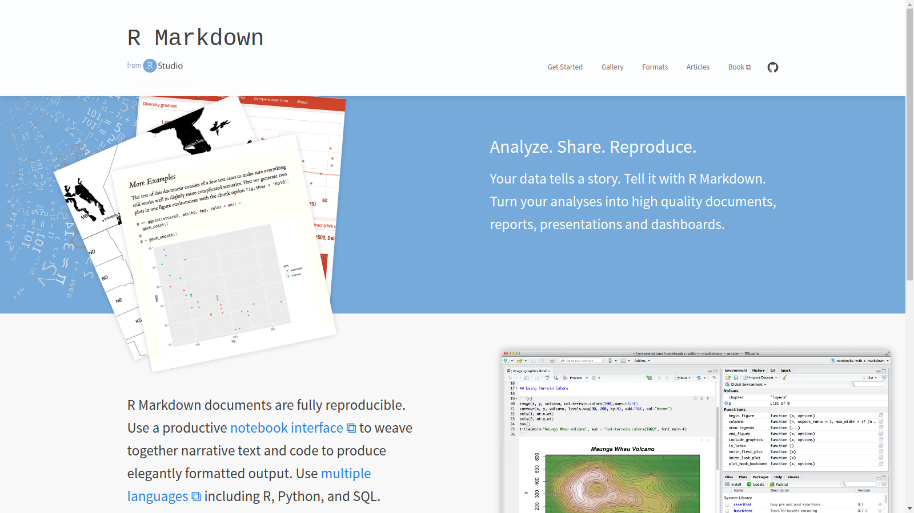

```{r setup, include=FALSE}
knitr::opts_chunk$set(echo = FALSE)
```


## Why R Markdown?

* Merge data, code and text
    + resulting in less errors (instead of `Ctrl+C`--`Ctrl+V`)
    
* Good reproducibility
* Formatting is performed only at the end
    + creating templates (reports, manuscripts, presentations ...)
    
* Easy collaboration
    + output: HTML, PDF, MS word and lot's more 
    + instead of only PDF in \LaTeX{} 

## How it works


```{r echo=FALSE,  fig.align="center", out.width="90%"}
knitr::include_graphics("rmarkdownflow.png")
```

- The R package knitr forms the backbone for knitting in Rstudio
- Pandoc processes the markdown file
- The creator of Rmarkdown from Rstudio and knitr: Yihui Xie (software engineer at RStudio)


## R Markdown from Rstudio  <http://rmarkdown.rstudio.com>


```{r echo=FALSE, out.width="100%"}
knitr::include_graphics("how-1-file.png")
```


## R Markdown from Rstudio  <http://rmarkdown.rstudio.com>


```{r echo=FALSE, out.width="100%"}

```

## R Markdown from Rstudio  <http://rmarkdown.rstudio.com>


```{r echo=FALSE, out.width="100%"}
knitr::include_graphics("rmarkdown-cheatsheet.pdf")
```

## R Markdown from Rstudio  <http://rmarkdown.rstudio.com>

This is an R Markdown presentation!!


